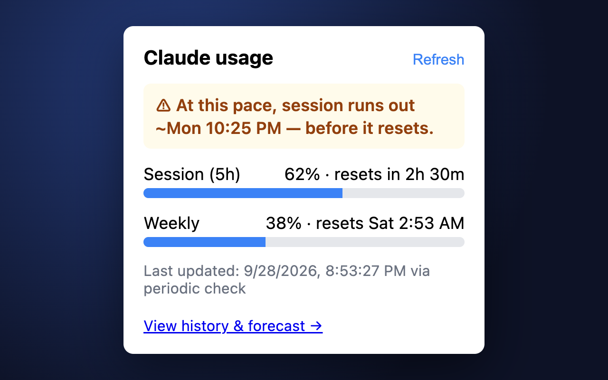

# headroom — Claude Usage Companion

[**Install from the Chrome Web Store →**](https://chromewebstore.google.com/detail/chjbjdabpficejgogljohhlobfaehepl)
(Edge can install the same listing directly; Firefox builds from source — see Installation below)



A cross-browser extension (Chrome, Edge, Firefox) with an optional local daemon that gives you
one place to see Claude usage across claude.ai and the Claude Code CLI: session and weekly
limit bars, burn-rate forecasts, multi-week history, CLI attribution, cross-project session
search, and retention warnings.

Usage data is captured at the network level (`fetch`/SSE), not by scraping claude.ai's DOM, so
the extension keeps working through frontend redesigns. Nothing leaves your machine.

> "headroom" is the repository name; "Claude Usage Companion" is the product name shown in the
> extension itself.

## Why this exists

Existing Claude usage trackers take one of two approaches, both with drawbacks: they inject UI
into claude.ai's DOM (which breaks on every frontend change), or they cover claude.ai chat only
and ignore the CLI. Neither forecasts usage or tracks history over time.

headroom is built differently, and adds what's missing elsewhere:

- Network-level capture instead of DOM scraping, so it's resilient to redesigns
- Burn-rate forecasting ("at current pace, reaches limit at ~8:00 PM")
- Multi-week usage history with charts
- CLI attribution surfaced directly in the browser
- Cross-project CLI session search
- Session retention warnings before Claude Code's 30-day log cleanup

**Out of scope, by design:** the Claude desktop app's per-conversation detail (not visible to a
browser; its usage is still reflected in your shared session/weekly totals) and API console /
pay-as-you-go usage.

## Installation

### Extension

**Chrome / Edge:** install from the
[Chrome Web Store](https://chromewebstore.google.com/detail/chjbjdabpficejgogljohhlobfaehepl)
(Edge can install Chrome Web Store extensions directly). Firefox isn't on a store yet — build it
from source below.

To build from source instead (or to develop):

```sh
git clone <this repo>
cd headroom
pnpm install
pnpm --filter @headroom/extension run build        # add ":firefox" suffix for Firefox
```

| Browser | Steps |
| --- | --- |
| Chrome / Edge (from source) | Open `chrome://extensions` (or `edge://extensions`), enable **Developer mode**, click **Load unpacked**, select `packages/extension/.output/chrome-mv3`. |
| Firefox | Run `pnpm --filter @headroom/extension run build:firefox`, then load `packages/extension/.output/firefox-mv2` via `about:debugging` → **This Firefox** → **Load Temporary Add-on**. For live reload during development, use `pnpm --filter @headroom/extension run dev:firefox` instead. |

Once installed, open claude.ai's **Settings → Usage** page once (or send a message) so the
extension can detect your account — a plain page load isn't enough, since it only recognizes
your account from the usage and chat requests it watches. After that it polls in the background
— the popup and dashboard update on their own.

### Daemon (optional)

The extension is fully functional on its own. The daemon is a separate, opt-in component that
reads your local Claude Code session logs (`~/.claude/projects/**/*.jsonl`) to unlock CLI
attribution, cross-project session search, and retention warnings. It never communicates with
claude.ai, and claude.ai never communicates with it. It is stateless — all persistent state
lives in the extension — and read-only apart from two things you trigger yourself: Guardrails
overrides and New Project scaffolding.

Requires Node.js ≥20.

```sh
npm install -g @rehberodhano/claude-usage-companion-daemon
claude-usage-daemon install    # generates a token, registers a login-time service, starts it
```

No token to copy or paste: open the extension's options page and it pairs with the daemon
automatically within about a minute (a **Check now** button forces this immediately). The
daemon exposes a one-time, unauthenticated `/pair` endpoint that hands the extension its token
on first request, then locks itself — see `packages/daemon/src/auth.ts` for the trust model.
Re-running `install` issues a fresh token and reopens the pairing window. A manual **Advanced**
field in the options page also accepts a pasted token directly, for edge cases.

**After reinstalling the extension** (or clearing its data), re-run `claude-usage-daemon install`:
the daemon hands out its token only once, so a fresh copy of the extension otherwise shows
"Already paired with another extension". Restoring a backup doesn't bring the connection back
either, by design.

`install` registers a background service so the daemon survives a reboot: a launchd agent on
macOS, a systemd `--user` unit on Linux, or a Task Scheduler task on Windows. On Linux, also run
`loginctl enable-linger $USER` so it survives logging out. To run it in the foreground instead,
use `claude-usage-daemon start`.

**Windows note:** the Task Scheduler registration path is unit-tested (mocked command
execution) but hasn't yet been verified end-to-end on a real Windows machine, unlike the macOS
and Linux paths. If `install` doesn't work as expected there, please open an issue — running
`claude-usage-daemon start` in the foreground works regardless of platform.

Running from a checkout instead (e.g. contributing) works the same way, just via `pnpm`:

```sh
cd packages/daemon
pnpm exec tsx src/cli.ts install
```

To uninstall:

| Platform | Command |
| --- | --- |
| macOS | `launchctl unload ~/Library/LaunchAgents/com.headroom.claude-usage-daemon.plist && rm ~/Library/LaunchAgents/com.headroom.claude-usage-daemon.plist` |
| Linux | `systemctl --user disable --now claude-usage-daemon.service` |
| Windows | `schtasks /delete /tn ClaudeUsageDaemon /f` |

The token file at `~/.config/claude-usage/token` can be deleted afterward as well.

### Statusline (optional)

`claude-usage-statusline` (installed alongside `claude-usage-daemon` by the npm package —
`packages/daemon/bin/statusline.mjs` when running from a checkout) is a self-contained script for
Claude Code's `statusLine` hook. It prints three segments:

- `Session: <pct>%` and `Weekly: <pct>%`, each with a reset countdown — read directly from
  Claude Code's own stdin payload (`rate_limits.five_hour` / `rate_limits.seven_day`, Pro/Max
  only, available after the first message in a session). These reflect the same account-level
  limits shown on claude.ai's Settings → Usage page, so they work without the daemon.
- `Today: <n> Tokens` — daemon-sourced CLI token total; prints nothing if the daemon isn't
  installed.

Point `statusLine` in `~/.claude/settings.json` directly at `claude-usage-statusline` (or its
absolute path, e.g.
`$(npm root -g)/@rehberodhano/claude-usage-companion-daemon/bin/statusline.mjs`), or pipe your
existing statusline script's stdin through it and append its output as an additional segment.

## Features

| Feature | Description |
| --- | --- |
| Limit bars | Session (5h) and weekly usage from `/usage` polling, upgraded to exact unrounded fractions by `message_limit` SSE events (claude.ai chat) or `rate_limit_event` entries (Claude Code on the web) while active. Reset countdowns switch from relative ("in 3h 14m") to absolute ("Thu, 8:00 PM") once more than a day out. |
| Usage credits | Mirrors claude.ai's own "Usage credits" spend for accounts with pay-as-you-go enabled: this month's spend against your $ limit, on the dashboard and as a popup row. |
| Burn-rate forecast | Linear projection over the current run since the last reset, with confidence labeled low/medium/high, plus a concrete suggestion (switch model / pace back) when at risk of hitting the limit before reset. |
| History dashboard | Weeks of local snapshot history as charts, with 24h/7d/30d windows. |
| Backup & restore | Export local usage history, Guardrails project fingerprints, and settings (excluding the daemon connection, which stays device-local) to a JSON file, and restore it later — additive only, never duplicates a snapshot already stored or overwrites a fresher Guardrails record. Protects against losing history when clearing browser data or moving to a new machine. |
| Headline | When something needs attention the popup leads with one line — "Session limit reached" or "At this pace, session runs out ~Thu 3:40 PM — before it resets" (only from a medium/high-confidence forecast on a bar with at least 10% used, and only when it beats the reset by 30+ minutes — so a barely-touched bar or a photo finish never cries wolf). |
| Progressive disclosure | Until the daemon is connected the dashboard shows only Usage & Forecast and CLI Attribution (which doubles as a copy-paste install prompt); Search, and the write-capable Guardrails / New Project tabs under an "Advanced" divider, appear once it pairs. First install opens the setup checklist; the first launch after an update shows a one-time "what's new". |
| Pace warning | Opt-in (Settings): a notification *before* a limit is hit — when the burn-rate forecast, on a bar with at least 10% used and at least medium confidence, lands 30+ minutes before the window resets. Once per limit window. |
| Threshold alerts | Configurable browser notifications (default: 80% / 95%). |
| On-page badge | A small, self-contained, toggleable usage indicator on claude.ai. |
| CLI attribution *(daemon)* | Token totals by project, by model (with each model's share of tokens), and by individual session — project and session lists are filterable by typing, so a long list doesn't mean scrolling to find one entry — plus a rough tokens-per-percent-of-weekly-limit estimate, applied per-project too ("~N% of this week") and, week by week, as a small CLI-vs-chat split chart. CSV export (matching whatever's currently filtered) alongside the existing per-session markdown export. |
| Session search *(daemon)* | Full-text search across local Claude Code sessions, with a one-click `cd <dir> && claude --resume <id>` copy button. |
| Retention warnings *(daemon)* | Flags sessions nearing Claude Code's 30-day log cleanup, with one-click markdown export (embedded images included, and an opt-in checkbox to include tool calls/results as short summaries). |
| Guardrails *(daemon)* | See and override Claude Code's permission rules across global/project/local scope layers, plus read-only visibility into hooks and skills, for a project you pick. Overrides only ever write to that project's gitignored `.claude/settings.local.json` — never a shared, committed file. "Apply recommended protections" denies every bundled known-risky command pattern not already covered, in one click, writing one rule at a time to avoid racing its own writes. Also previews and edits CLAUDE.md docs (rendered markdown, with an explicit Save — no autosave). A cross-project health checklist (CLAUDE.md / settings / hooks / skills present?) sits above the picker, and a project you've viewed before flags exactly what changed ("2 new allow rules, 1 hook removed") since you last viewed it — escalated to a warning if a newly-allowed rule matches a known-risky command pattern. |
| Subagent model routing *(daemon)* | See and change which model each project subagent uses (`inherit`/`opus`/`sonnet`/`haiku`, or a custom model id) directly from its `.claude/agents/*.md` frontmatter — e.g. Opus for a planning subagent, Haiku for a quick one. Only ever writes to a project's own agents; a personal global agent is shown read-only. |
| Daemon liveness | The options page shows whether the daemon was reachable on its last background check, not just whether pairing once succeeded — a crashed or stopped daemon no longer silently shows as "Connected automatically" forever. A setup checklist also flags the other silent prerequisites (opened Settings → Usage on claude.ai yet? first snapshot captured? daemon paired?) that would otherwise leave tabs empty with no explanation. |
| Attention badge *(daemon)* | A small count on the toolbar icon of sessions nearing Claude Code's 30-day log cleanup, so they don't stay invisible until you happen to open the right tab. |
| New Project *(daemon)* | Scaffold a new project folder, or fill in an existing one, with a name/description, a free-form "Stack" tag picker (typing a tag not in the curated list adds it, growing the list over time), and starter files for whichever of six real templates the picked stack tags resolve to (Node/TypeScript, Python, Go, Java, Kotlin, C#) — anything else is recorded as metadata only, no scaffold generated. Detects an existing folder's stack automatically (recursively, so a stack marker in a subdirectory like a mobile app's native `android/` folder is still found), never by reading document content. Optional git init, permission-rule protections, and a real install/build/test "verify" run. |

## Privacy & security

- Nothing leaves your machine — no accounts, no cloud sync, no analytics, no crash reporting.
- The extension only talks to `https://claude.ai` and `http://127.0.0.1` (the daemon).
- The daemon binds to `127.0.0.1` only, requires a bearer token on every route except
  `/health`, and rejects any `http(s):` page origin outright — only extension-scheme origins
  are accepted.
- No conversation content is ever logged. Logs contain only ids, counts, and timestamps.
- Full privacy policy: [`docs/privacy.html`](docs/privacy.html), published at
  https://rehberodhano.github.io/headroom/privacy.html.
- All claude.ai endpoints in use are undocumented and unofficial, and can change without
  notice — this has already been observed between two captures a few days apart. Every payload
  is validated against a schema that fails soft: a bad snapshot is skipped and logged rather
  than breaking the pipeline.

## Known limitations

- Per-model limit rows are not shown — no captured `/usage` response has ever included a
  `limits[]` entry beyond the overall session/weekly kinds, so there is nothing real to build
  against yet.
- The published extension's host permissions hardcode the daemon's default port
  (`http://127.0.0.1:4317/*`), because Chrome's manifest validator rejects a wildcard port. Running
  the daemon on a custom `PORT` (the daemon URL is no longer editable in the options page) isn't
  supported.
- **Requires an active Claude plan with usage limits.** A free/no-plan claude.ai account's
  Settings → Usage link redirects to a pricing/upgrade page instead of a usage page — there's
  nothing there for the extension to read, so session/weekly tracking isn't available until
  upgrading. This is claude.ai's own routing, not something the extension controls.

## Development

Monorepo, pnpm workspaces, TypeScript strict mode throughout.

```
packages/
  shared/     zod schemas + normalized usage model, shared across extension and daemon
  extension/  WXT + React + Dexie — the browser extension
  daemon/     Node + Hono — the optional local daemon
```

```sh
pnpm install
pnpm -r run test         # 613 tests across the three packages as of this writing
pnpm -r run typecheck
pnpm -r run build
pnpm --filter @headroom/extension run test:e2e   # builds, then drives the real extension in Chromium against a stubbed claude.ai
```

Fixtures for claude.ai response shapes live in `fixtures/claude-ai/`. Every schema in
`packages/shared` is derived from a real, anonymized capture rather than a guess.

## License

MIT — see [`LICENSE`](./LICENSE).
